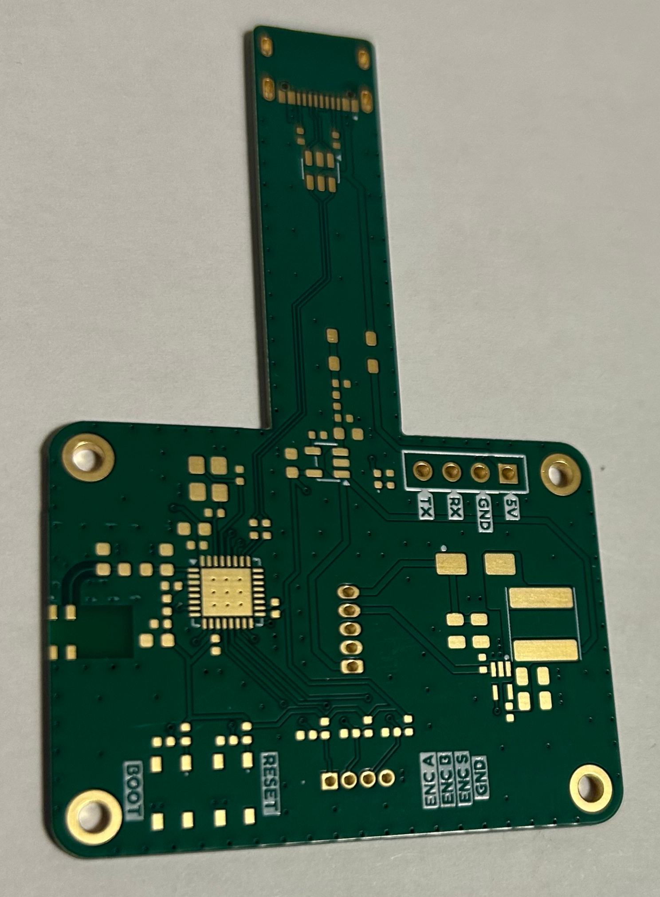

# Hi-Light
A Bed side lamp that is also a way of connecting to your loved ones using colourful light. 
It consists of 2 custom PCB's. 
The main board consists of a ESP32-C3 microcontroller. An exeternal rotary encoder is connected to be be able to control the brightness and the button is used to turn on or off the light and also to send a "Hi". 
The second board is the "Light bulb" which has some filament LEDs and 20 WS2813B RGB LEDs. 
The communication between the boards is done through MQTT. 

## Light board

## Light bulb

